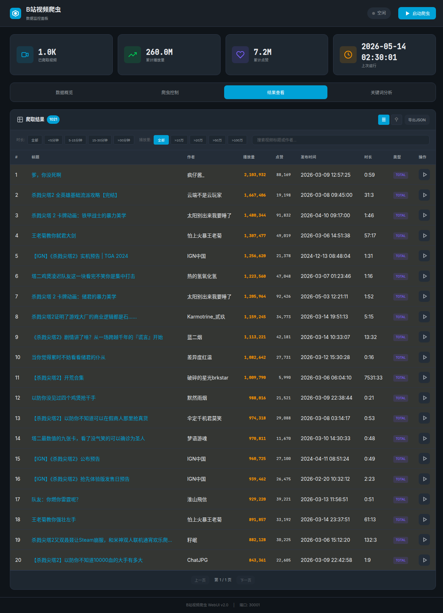

# B站视频分析 WebUI

B站视频爬虫数据分析工具，用于分析杀戮尖塔题材视频的播放数据、关键词效果和发布规律。



## 功能特性

### 数据分析
- **散点图**：可视化播放量、时长、发布天数的关系
  - 滚轮缩放（以鼠标为中心）
  - 滑块缩放（从原点开始）
  - 点击查看视频详情

- **播放量分布**：统计不同播放量级别的视频数量

- **时长分布**：环形图展示不同时长区间的视频占比

- **发布时间线**：按小时/星期分布统计发布时机

### 关键词分析
- 高频词统计
- 关键词效果分析（平均播放量）
- 成功模式发现（"以防你不知道"、"假如"等）

### 视频筛选
- 时长筛选：<5分钟 / 5-15分钟 / 15-30分钟 / >30分钟
- 播放量筛选：>10万 / >20万 / >50万 / >100万
- 标题关键词搜索
- 关键词筛选

### TOP榜单
- 列表/TOP视图切换
- TOP50排名
- 爆款标记（>50万高亮）

## 数据洞察（杀戮尖塔题材）

### 时长与爆款率
| 时长 | 视频数 | >10万播放比例 |
|-----|-------|--------------|
| <5分钟 | 641条 | **91.4%** |
| 5-30分钟 | 293条 | 79.5% |
| >30分钟 | 67条 | 样本少但均值高 |

### 爆款标题模式
| 模式 | 数量 | 平均播放 |
|-----|------|---------|
| "以防你不知道" | 38条 | **29.4万** |
| "mod/模组" | 50条 | 27.2万 |
| "杀戮尖塔2" | 470条 | 26.8万 |
| "假如" | 78条 | 18.0万 |

### 发布时机
- **黄金时段**：17-18点、11-12点
- **最佳时段**：17-18点（下班时间）
- **周末**：发布量较少但竞争也少

## 技术栈

- **前端**：原生 JavaScript、Canvas 绘图
- **后端**：Flask
- **数据源**：B站搜索 API

## 本地运行

```bash
cd bilibili_video_fenxi_webui
python app.py
```

访问 http://localhost:30001

## 项目结构

```
bilibili_video_fenxi_webui/
├── app.py              # Flask 后端
├── index.html          # 前端页面
├── styles.css          # 样式表
├── screenshot.png      # 界面截图
├── REQUIREMENTS.md     # 需求文档
├── ANALYSIS_REPORT.md  # 数据分析报告
└── FLASK_API.md        # API 文档
```

## 数值格式

- 播放量：w（万）
- 点赞：w（万）
- 1000 以上：k（千）

## 作者

eternitylarva1

## 许可证

MIT