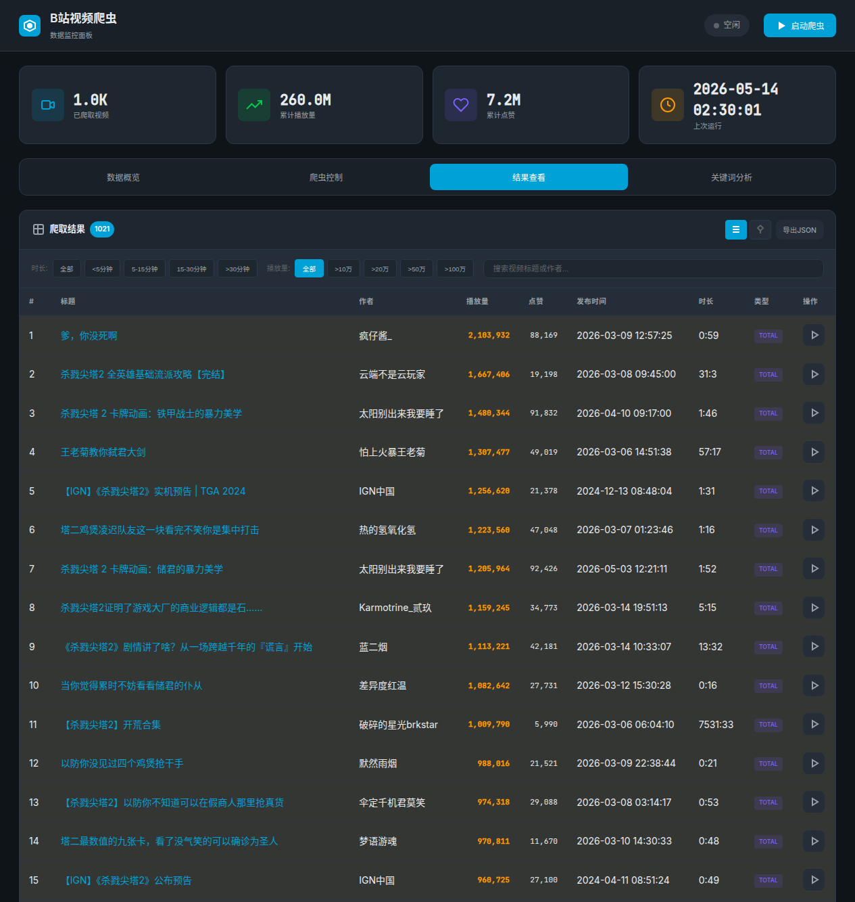
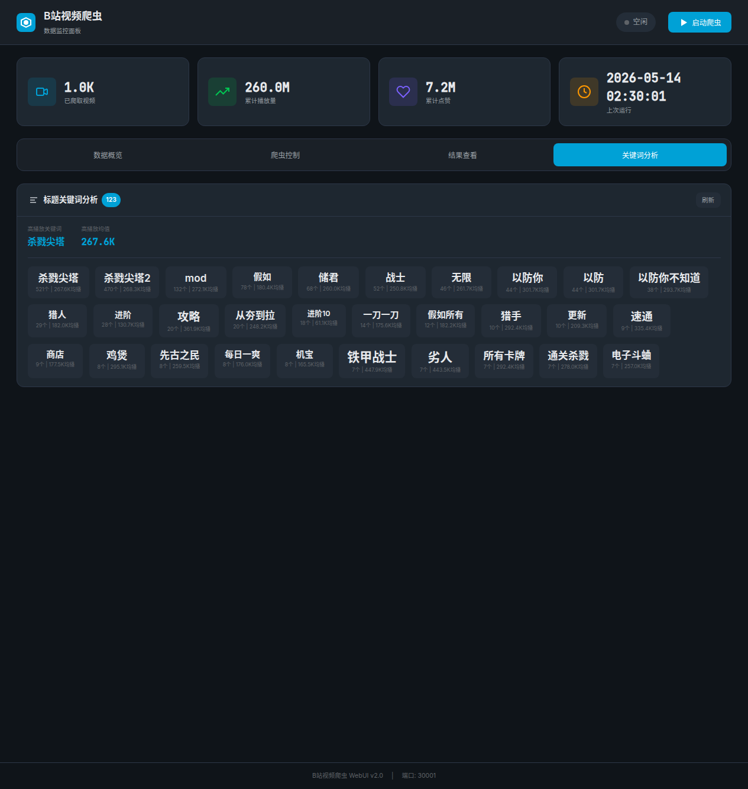
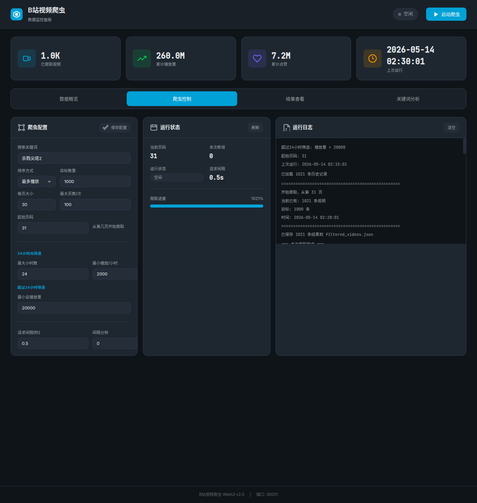

# B站视频分析 WebUI

B站视频爬虫数据分析工具，用于分析杀戮尖塔题材视频的播放数据、关键词效果和发布规律。


## 功能特性

### 数据分析
- **散点图**：可视化播放量、时长、发布天数的关系
  - 滚轮缩放（以鼠标为中心）
  - 滑块缩放（从原点开始）
  - 点击查看视频详情

- **播放量分布**：统计不同播放量级别的视频数量

- **时长分布**：环形图展示不同时长区间的视频占比

- **发布时间线**：按小时/星期分布统计发布时机






### 关键词分析
- 高频词统计
- 关键词效果分析（平均播放量）
- 成功模式发现（"以防你不知道"、"假如"等）

### 视频筛选
- 时长筛选：<5分钟 / 5-15分钟 / 15-30分钟 / >30分钟
- 播放量筛选：>10万 / >20万 / >50万 / >100万
- 标题关键词搜索
- 关键词筛选

### TOP榜单
- 列表/TOP视图切换
- TOP50排名
- 爆款标记（>50万高亮）

## 快速开始

### 1. 下载源码
```bash
git clone https://github.com/eternitylarva1/bilibili_video_fenxi_webui.git
cd bilibili_video_fenxi_webui
```

### 2. 配置爬虫
编辑 `crawler/config.yaml`：
```yaml
keyword: "你的搜索关键词"  # 如"杀戮尖塔2"
sessdata: "你的SESSDATA"   # B站Cookie中的SESSDATA
buvid3: "你的buvid3"       # B站Cookie中的buvid3
```

### 3. 安装依赖

#### Windows
```powershell
# 从 microsoft store 或 python.org 安装 Python
pip install flask pyyaml requests
```

#### Linux / WSL
```bash
pip install flask pyyaml requests
```

#### macOS
```bash
# 可能需要先安装 python3
pip3 install flask pyyaml requests
```

### 4. 启动爬虫采集数据

#### Windows
```powershell
cd crawler
python bilibili_spider.py
```

#### Linux / WSL / macOS
```bash
cd crawler
python3 bilibili_spider.py
# 或使用脚本
bash run_spider.sh
```

### 5. 启动WebUI分析

#### Windows
```powershell
cd ..
python app.py
```

#### Linux / WSL / macOS
```bash
cd ..
python3 app.py
```

访问 http://localhost:30001

## 完整工作流程

```
┌─────────────────────────────────────────────────────────────┐
│  1. 配置 Cookie                                             │
│     - 登录B站，获取 SESSDATA 和 buvid3                       │
│     - 填写搜索关键词                                         │
├─────────────────────────────────────────────────────────────┤
│  2. 采集数据                                                 │
│     - 运行爬虫脚本                                           │
│     - 数据保存到 filtered_videos.json                         │
├─────────────────────────────────────────────────────────────┤
│  3. 数据分析                                                 │
│     - 查看散点图发现规律                                      │
│     - 使用关键词分析找到爆款模式                              │
│     - 筛选不同维度分析                                        │
├─────────────────────────────────────────────────────────────┤
│  4. 指导创作                                                 │
│     - 借鉴成功标题模式                                        │
│     - 选择最佳发布时机                                        │
│     - 确定最佳视频时长                                        │
└─────────────────────────────────────────────────────────────┘
```

## 项目结构

```
bilibili_video_fenxi_webui/
├── app.py                    # Flask 后端
├── index.html                # 前端页面
├── styles.css                # 样式表
├── screenshot_*.png          # 多张界面截图
├── README.md                  # 本文档
├── REQUIREMENTS.md           # 需求文档
├── ANALYSIS_REPORT.md         # 数据分析报告
├── FLASK_API.md              # API 文档
└── crawler/
    ├── bilibili_spider.py    # 爬虫脚本
    ├── run_spider.sh         # 爬虫运行脚本
    ├── config.yaml           # 爬虫配置（需要填写）
    └── filtered_videos.json  # 默认数据（杀戮尖塔题材）
```

## 获取 B站 Cookie

1. 登录 [bilibili.com](https://www.bilibili.com)
2. 按 F12 打开开发者工具
3. 切换到「Network」标签
4. 刷新页面，点击任意请求
5. 在「Request Headers」中找到 `Cookie`
6. 复制 `SESSDATA` 和 `buvid3` 的值

## 数据洞察（杀戮尖塔题材）

### 时长与爆款率
| 时长 | 视频数 | >10万播放比例 |
|-----|-------|--------------|
| <5分钟 | 641条 | **91.4%** |
| 5-30分钟 | 293条 | 79.5% |
| >30分钟 | 67条 | 样本少但均值高 |

### 爆款标题模式
| 模式 | 数量 | 平均播放 |
|-----|------|---------|
| "以防你不知道" | 38条 | **29.4万** |
| "mod/模组" | 50条 | 27.2万 |
| "杀戮尖塔2" | 470条 | 26.8万 |
| "假如" | 78条 | 18.0万 |

### 发布时机
- **黄金时段**：17-18点、11-12点
- **最佳时段**：17-18点（下班时间）
- **周末**：发布量较少但竞争也少

## 技术栈

- **前端**：原生 JavaScript、Canvas 绘图
- **后端**：Flask
- **数据源**：B站搜索 API

## 数值格式

- 播放量：w（万）
- 点赞：w（万）
- 1000 以上：k（千）

## 作者

eternitylarva1

## 许可证

MIT